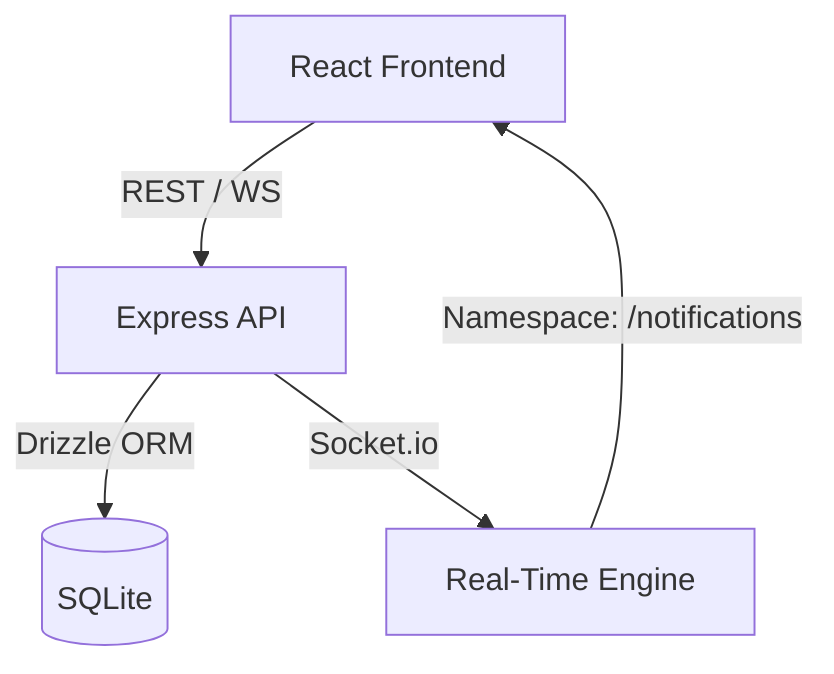

# PulseStack — Real-Time Notification Infrastructure

PulseStack is a high-performance, scalable real-time notification system built to satisfy the requirements of a senior-level system design assignment. It provides a robust multi-tenant foundation for delivering, tracking, and managing notifications across workspaces.

## Overview

PulseStack enables real-time communication between server-side events and client-side interfaces. It is built as a TypeScript monorepo, ensuring type safety from the database schema to the frontend UI components. The system handles lifecycle events for notifications, including creation, delivery, read-state synchronization, and deletion.

## Implemented Features

### Backend
- **JWT Authentication**: Secure stateless authentication for REST and WebSocket connections.
- **RBAC & Multi-Tenancy**: Built-in Workspace roles (Owner, Admin, Member) to control notification publishing.
- **Publishing Engine**: Supports both global workspace broadcasts and direct user-to-user notifications.
- **Real-Time Push**: Instant delivery via Socket.io using a namespaced room strategy.
- **Persistence**: Relational storage using Drizzle ORM for notifications, receipts, and membership.
- **Unread Tracking**: Optimized unread count calculation per user.

### Frontend
- **Notification Center**: A real-time Bell component with live badge updates.
- **Infinite Scrolling**: Efficient paginated fetching using `@tanstack/react-query`.
- **Optimistic UI**: Immediate UI updates for marking as read and deleting notifications.
- **Admin Dashboard**: Role-based UI for publishing notifications to the workspace.
- **Real-Time Toasts**: Instant visual feedback on incoming notifications.

## Architecture Summary

- **Monorepo Design**: Managed with Turborepo for optimized builds and shared packages (`db`, `types`, `config`, `utils`).
- **Service Layer**: Business logic is decoupled from controllers for testability and reuse.
- **Socket Room Strategy**: Uses `workspace:<id>` and `user:<id>` rooms for efficient targeted delivery.

## Key Architectural Decisions

- **SQLite for Portability**: Chosen for zero-config setup while maintaining full relational integrity.
- **Receipt Pattern**: Uses a `notification_receipts` table to decouple notification content from per-user delivery state, enabling efficient broadcasts.
- **Tanstack Query**: Utilized `useInfiniteQuery` to handle complex server state, pagination, and caching without manual boilerplate.
- **Namespaced Sockets**: Isolated `/notifications` namespace to prevent event collision and optimize socket traffic.

## Tradeoffs

- **Offset Pagination**: Used for simplicity over cursor pagination (recommended for massive datasets).
- **SQLite Single Instance**: Limited to vertical scaling; however, the architecture is Postgres-ready.
- **No Job Queue**: Notifications are processed synchronously in the request cycle; production would use BullMQ or Kafka for heavy broadcasts.
- **Single Instance Sockets**: Logic assumes a single API instance; Multi-instance would require a Redis adapter.

## Scaling Strategy

- **Horizontal Scaling**: Introduction of a Redis adapter for Socket.io and stateless API clustering.
- **Database Transition**: Replace SQLite with a managed Postgres cluster for high concurrency.
- **Async Processing**: Offload broadcast receipt generation to background workers.
- **Edge Delivery**: Integration with CDN or edge functions for faster delivery.

## Future Vision — PulseStack SaaS

PulseStack is designed to evolve into a developer-first Notification-as-a-Service:
- **Event Ingestion**: API key-based endpoints for external systems to trigger notifications.
- **Templates Engine**: Support for Liquid or Handlebars templates for rich content.
- **Multi-Channel Delivery**: Automatic fallbacks to Email, SMS, or Slack.
- **Observability**: Detailed delivery logs and read-receipt analytics.
- **Tenant Isolation**: Hardened data isolation for true SaaS multi-tenancy.

## Development Notes

This project was developed with the assistance of AI tooling (ChatGPT and Google’s Antigravity editor) for accelerating boilerplate generation, documentation drafting, and testing scripts.
All architectural decisions, schema design, system tradeoffs, and implementation logic were reviewed and validated manually. AI was used as a productivity multiplier — not as a replacement for system design or reasoning.
The final architecture, code structure, and scalability considerations reflect deliberate engineering decisions.

Leveraging AI tools allowed me to focus more deeply on system design, data modeling, and real-time delivery architecture rather than repetitive scaffolding.
